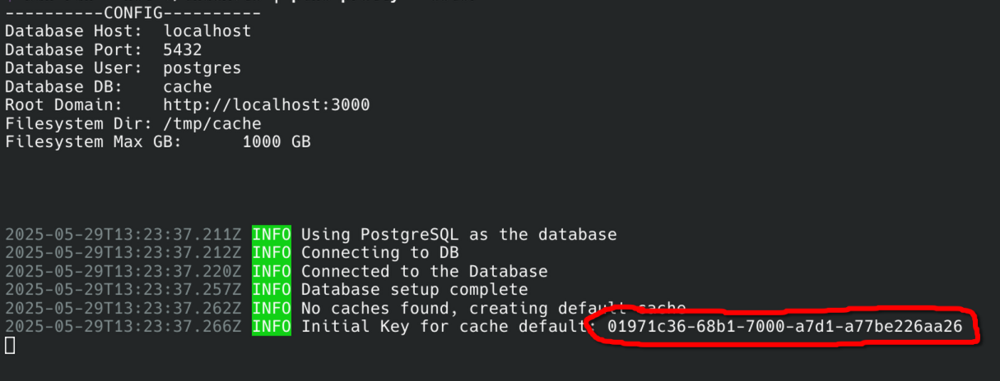

# Iglu Cache
The cache component of the iglu project. It's a simple nix cache implementation that takes files via the cachix client and stores them in the filesystem.
To install dependencies:

## Installation
To install the iglu cache, use the provided docker-compose.yml file in the root directory of the project [[docker-compose.yml]](./docker-compose.yml). This file sets up the necessary services, including a PostgreSQL database and the iglu cache service itself.
Before you start the services, make sure you have the required environment variables set up (either in a .env file or directly in the docker-compose file).

### Mandatory Environment Variables
You need to set at least these variables in the environment of the cache service:
- `CACHE_ROOT_DOMAIN`: The domain name of where your cache server should be available.
- `CACHE_FILESYSTEM_DIR`: The directory where the cache files should be stored (Careful, there will be a lot of read and writes happening at this dir, so choose accordingly).
- `POSTGRES_HOST`: Host of the postgresql server.
- `POSTGRES_PORT`: Port of the postgresql server.
- `POSTGRES_USER`: User of the postgresql server.
- `POSTGRES_PASSWORD`: Password for the user of the postgresql server.
- `POSTGRES_DB`: Database of the postgresql server.
- `CACHE_MAX_GB`: The maximum size of the cache in gigabytes. If the cache exceeds this size, old entries will be removed.

### Optional Environment Variables
Additionally, you may also specify the following variables:
- `LOG_LEVEL` (default: `info`): The log level of the application.
- `LOG_JSON` (default: `false`): If set to true, the logs will be in JSON format.
- `AUTO_FIX_CACHE_ROOT_DOMAIN`: If this is set to false the `CACHE_ROOT_DOMAIN` is only used for new caches. If this is set to true (which is the default) all caches get the new domain on startup.
- `PG_MODE` (default: `normal`) - If set to normal the application will use the postgres database. If set to lite, then a pglite database will be used instead and all postgres config variables will be ignored.
### Example of a configured docker-compose.yml file
```yaml
services:
  postgres:
    image: postgres:latest
    environment:
      POSTGRES_USER: postgres
      POSTGRES_PASSWORD: postgres
      POSTGRES_DB: cache
    command: ["postgres", "-c", "log_statement=all"]
    ports:
      - "5432:5432"
    volumes:
      - ./postgres_data:/var/lib/postgresql/data

  cache:
    image: ghcr.io/iglu-sh/iglu-cache-docker:latest
    environment:
      CACHE_ROOT_DOMAIN: http://localhost:3000
      POSTGRES_USER: postgres
      POSTGRES_PASSWORD: postgres
      POSTGRES_DB: cache
      POSTGRES_HOST: postgres
      POSTGRES_PORT: 5432
      CACHE_FILESYSTEM_DIR: /tmp/cache #Should be mounted to an outside container if you want to persist files, else set to something in the container
      CACHE_MAX_GB: 10
      LOG_LEVEL: info
    volumes:
      - ./cache/nar_files:/tmp/cache
    ports:
      - "3000:3000"
```
### Starting the Services
To start the services simply `docker-compose up` the compose file. This will start the PostgreSQL database and the iglu cache service. The cache service will automatically connect to the PostgreSQL database and create the necessary tables if they do not exist.
Once it's running, you'll want to check the logs of the cache service to get your first api token:

### Cachix Setup
You will need the token from above to authenticate with the cache service. You can do that by running this cachix command:
```bash
cachix authtoken <your_api_token>
```
Now edit your cachix config (usually `~/.config/cachix/cachix.dhall`) and change the `hostname` to your cache service domain, e.g. `http://localhost:3000` if you are running it locally. The config should look like this:
```dhall
{ authToken = "01970391-0a51-7000-9b0f-021b01f78b31"
, hostname = "http://localhost:3000 # or your cache service domain"
, binaryCaches = [] : List { name : Text, secretKey : Text }
}
```
Before you start pushing paths to the cache, you need to create a public-private key pair for cachix. You can do this by running:
```bash
cachix generate-keypair  <your_cache_name_usually_just_default>
```
> [!Note]
> It may be necessary to first run `export CACHIX_SIGNING_KEY=<yoursigningkey>` to ensure that the cachix client uses the correct signing key for your cache. Usually cachix will also give you this command after you generated the key pair.
 
This will create a public and private key in your cachix config directory. You can now push paths to the cache using the cachix client:
```bash
nix build my-derivation | cachix push <default_or_your_cache_name>
```


## Development
You need a working bun installation as well as a working postgres database. It is recommended that you use the docker-compose.yml file for installation.


**IMPORTANT:** If you use the `dockder-commpose.yml` to start the service you have to build the image with `nix build .#iglu-cache-docker && docker load < result` first and then execute `docker comopse up` 


```bash
bun install
bun run prod
```
This project was created using `bun init` in bun v1.2.11. [Bun](https://bun.sh) is a fast all-in-one JavaScript runtime.
# cache
Store paths can be pushed with
```bash
nix-store -qR ${which wget} | cachix push boerg
```
